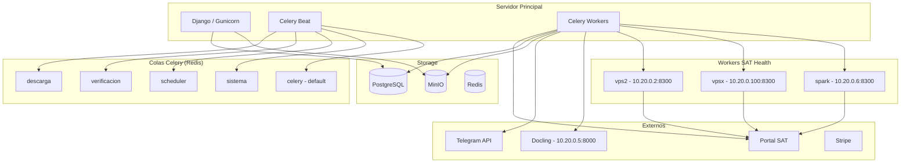

# Auditoría Técnica — Sistema de Descarga de CFDIs

**Fecha:** 2026-04-09
**Alcance:** Revisión completa del sistema de descarga automática de CFDIs del SAT
**Archivos auditados:** 12 módulos principales (~4,500 líneas de código)
**Metodología:** Lectura de código fuente, trazado de flujos, análisis de modelos y tasks

---

## 1. Resumen Ejecutivo

El sistema de descarga de CFDIs de Cirrus es **funcional y está en producción**. La arquitectura es sólida: cola de prioridad con reintentos escalonados, monitoreo de salud del SAT distribuido en 3 nodos, detección nocturna de gaps, y supervisor autónomo cada 15 minutos.

Sin embargo, se identificaron **17 hallazgos** que representan riesgos técnicos:

| Severidad | Cantidad | Impacto potencial |
|-----------|----------|-------------------|
| CRÍTICO   | 4        | Pérdida de datos, exposición de material criptográfico |
| ALTO      | 5        | Degradación del servicio, falsos positivos en completitud |
| MEDIO     | 5        | Experiencia de usuario, resiliencia operacional |
| BAJO      | 3        | Observabilidad, ergonomía |

**Veredicto:** El sistema funciona correctamente en condiciones normales. Los riesgos críticos se manifiestan en escenarios de fallo (worker crash, MinIO inconsistencia, SAT silencioso). Se recomienda abordar los críticos en las próximas 2 semanas.

---

## 2. Arquitectura del Sistema



### Componentes principales

| Componente | Función | Archivo principal |
|------------|---------|-------------------|
| SATEngine | RPA con Playwright — login al SAT y descarga de XMLs | `sat_scrapper_core` (paquete externo) |
| Scrapper Service | Puente entre Celery y SATEngine | `core/services/scrapper.py` |
| Job Scheduler | Genera y programa jobs de descarga | `core/services/job_scheduler.py` |
| Pipeline Manager | Orquesta procesos multi-paso con tracking | `core/services/pipeline_manager.py` |
| Supervisor | Monitoreo autónomo + acciones correctivas | `core/services/supervisor.py` |
| SAT Health Worker | Probes distribuidos de login al SAT | `sat_health_worker/worker.py` |
| Monitor | Logging centralizado → SystemLog + Telegram | `core/services/monitor.py` |

---

## 3. Hallazgos CRÍTICOS

### C1. Sin `transaction.atomic` en procesamiento de XMLs

**Archivo:** `core/services/scrapper.py`, líneas 93-96
**Descripción:** La fase `xml_process` sube archivos a MinIO y luego inserta registros en PostgreSQL secuencialmente dentro de `process_downloaded_xmls()`. Si la inserción en BD falla a mitad de camino (ej. constraint violation, conexión perdida), quedan archivos huérfanos en MinIO sin registro en BD.

**Impacto:** Inconsistencia de datos — XMLs en MinIO que no aparecen en la plataforma. Acumulación silenciosa de storage sin referencia.

**Fix recomendado:**
```python
from django.db import transaction

with StepTimer(descarga_log, "xml_process", "cirrus") as step:
    with transaction.atomic():
        processed_count = process_downloaded_xmls(download_dir, empresa)
    step.metadata = {"processed": processed_count}
```
Adicionalmente, implementar rollback de uploads MinIO en caso de excepción.

---

### C2. `asyncio.run()` en worker Celery

**Archivo:** `core/services/scrapper.py`, línea 86
**Descripción:** `asyncio.run(_run_engine(config))` lanza un nuevo event loop. Esto funciona hoy porque Celery usa el pool `prefork` (procesos sin event loop). Pero si alguien cambia a `gevent` o `eventlet` (común para optimizar I/O), `asyncio.run()` lanza `RuntimeError: This event loop is already running`.

**Impacto:** Ruptura total del descargador si se cambia la configuración del pool de Celery.

**Fix recomendado:**
```python
from asgiref.sync import async_to_sync

result = async_to_sync(_run_engine)(config)
```
O bien, detectar si hay un loop existente antes de crear uno nuevo.

---

### C3. FIEL en /tmp sin garantía de limpieza

**Archivo:** `core/services/scrapper.py`, líneas 49-51 (descarga) y 106-114 (cleanup)
**Descripción:** `get_fiel_for_scraping()` descarga archivos .cer y .key a un `tempfile.mkdtemp()`. El cleanup está en un bloque `finally`, pero si el worker muere abruptamente (OOM kill, SIGKILL, reinicio del servidor), el `finally` no se ejecuta y quedan archivos criptográficos sensibles en disco indefinidamente.

**Impacto:** Exposición de material criptográfico (FIEL) en el filesystem. Un atacante con acceso al servidor podría extraer certificados.

**Fix recomendado:**
1. Tarea periódica que limpie `/tmp/cirrus_*` con más de 1 hora de antigüedad
2. Considerar montar `/tmp` en tmpfs (RAM) para que se limpie automáticamente en reinicio
3. Usar `NamedTemporaryFile(delete=True)` donde sea posible

---

### C4. Sin Dead Letter Queue en Celery

**Archivo:** `cirrus/settings.py`, configuración Celery
**Descripción:** No existe configuración de DLQ. Si un mensaje Celery falla en deserialización, si la task no está registrada, o si el worker rechaza un mensaje por razón inesperada, el mensaje se pierde silenciosamente. La tarea `descargar_cfdis` tiene `acks_late=True` y `reject_on_worker_lost=True`, pero esto solo cubre esa task específica.

**Impacto:** Jobs de descarga perdidos sin rastro. Posible pérdida de periodos completos sin que nadie lo note (hasta la auditoría nocturna).

**Fix recomendado:**
- Configurar `task_acks_late = True` globalmente
- Agregar `task_reject_on_worker_lost = True` globalmente
- Configurar DLQ en Redis para capturar mensajes rechazados
- Monitorear tamaño de la DLQ con alerta

---

## 4. Hallazgos ALTOS

### A1. `completado_vacio` puede enmascarar fallos silenciosos del SAT

**Archivo:** `core/tasks.py`, líneas 700-713
**Descripción:** Si un job completa 3 veces con 0 CFDIs, se marca como `completado_vacio` (asumiendo que no hubo actividad fiscal ese mes). Pero el SAT puede fallar silenciosamente: la página carga, el login funciona, pero la consulta no devuelve resultados por error interno.

**Riesgo:** Meses con actividad fiscal real marcados permanentemente como vacíos. La auditoría nocturna no los repara porque el estado no es "error".

**Fix recomendado:** Validación secundaria — si un RFC tiene CFDIs en los meses adyacentes pero 0 en el mes marcado `completado_vacio`, re-encolar con un flag de "verificación extra".

---

### A2. Health probes usan FIELs de producción

**Archivo:** `core/tasks.py`, líneas 1236-1241
**Descripción:** `SAT_HEALTH_RFCS` contiene 4 RFCs reales que se usan para probar login al SAT cada 5 minutos, rotando entre 3 nodos. Esto genera ~288 logins diarios por RFC.

**Riesgo:** El SAT podría detectar patrones de login automatizado y bloquear esos RFCs, afectando descargas reales de producción.

**Fix recomendado:** Usar FIELs dedicadas exclusivamente para health probes, no asociadas a empresas con descargas activas.

---

### A3. Docling hardcodeado a IP interna

**Archivo:** `core/services/csf_parser.py`, línea 14
**Descripción:** `DOCLING_URL = "http://10.20.0.5:8000/extract"` está hardcodeado. Si nodo5 se cae o cambia de IP, todas las CSF fallan. El fallback a pdfplumber existe pero es menos preciso (regex vs OCR inteligente).

**Fix recomendado:** Mover a variable de entorno (`DOCLING_URL`), agregar health check periódico, considerar instancia de respaldo.

---

### A4. Logging texto plano en sistema distribuido

**Archivo:** `cirrus/settings.py`, líneas 228-275
**Descripción:** El logging usa formato texto plano a consola y archivo (`logs/cirrus.log`). Con workers Celery en múltiples procesos y 3 nodos de health probe, correlacionar un fallo requiere buscar manualmente en múltiples fuentes.

**Fix recomendado:** JSON structured logging + stack centralizado (ELK, Loki, o Datadog Logs).

---

### A5. Cuello de botella: 1 job por ciclo de 5 minutos

**Archivo:** `core/tasks.py`, líneas 641-649
**Descripción:** `procesar_cola_descargas()` procesa máximo 1 job por ejecución, con límite de 3 concurrentes. El cálculo: 100 empresas × 12 meses × 2 tipos = 2,400 jobs. A 1 job/5min = 8,333 minutos = **5.8 días** para vaciar la cola completa.

**Fix recomendado:** Procesar N jobs por ciclo (configurable), no solo 1. El límite de 3 concurrentes ya protege contra saturación.

---

## 5. Hallazgos MEDIOS

| # | Hallazgo | Archivo | Fix |
|---|----------|---------|-----|
| M1 | Sin paginación en lista de CFDIs — puede trabar el browser con miles de registros | `frontend/templates/app/cfdis_list.html` | Agregar paginación server-side |
| M2 | `fail_silently=True` en emails de confirmación — pueden no llegar sin aviso | `accounts/views.py` | Cambiar a `fail_silently=False` + try/except con log |
| M3 | Rate limiting almacenado en Redis cache (volátil) — se pierde en restart | `accounts/views.py` | Usar persistent store o Redis con AOF |
| M4 | Sin 2FA para cuentas admin | `accounts/views.py` | Implementar TOTP para usuarios staff |
| M5 | Scripts operacionales sin `transaction.atomic` | `scripts/migrate_jessica.py` | Envolver en `@transaction.atomic` |

---

## 6. Hallazgos BAJOS

| # | Hallazgo | Fix |
|---|----------|-----|
| B1 | Sin APM/tracing (Sentry, Datadog) | Integrar Sentry para error tracking |
| B2 | Tema oscuro hardcodeado sin toggle | Agregar toggle light/dark |
| B3 | Telegram como único canal de alertas | Agregar canal secundario (email, Slack, PagerDuty) |

---

## 7. Top 3 Riesgos y Próximos 5 Pasos

### Top 3 Riesgos

1. **Inconsistencia MinIO/PostgreSQL** (C1) — Puede acumular datos huérfanos silenciosamente
2. **FIEL expuesta en /tmp** (C3) — Riesgo de seguridad si hay acceso al servidor
3. **Meses falsamente vacíos** (A1) — Puede causar que clientes no vean CFDIs que sí existen

### Próximos 5 Pasos (en orden de prioridad)

1. **Envolver `process_downloaded_xmls` en `transaction.atomic()`** — Fix inmediato, bajo riesgo, alto impacto
2. **Agregar tarea de limpieza de /tmp/cirrus_*** — Crear task periódica que limpie archivos temporales FIEL >1hr
3. **Configurar `task_acks_late=True` global + DLQ** — Proteger contra pérdida de mensajes Celery
4. **Implementar validación secundaria para `completado_vacio`** — Comparar contra meses adyacentes antes de confirmar vacío
5. **Mover Docling URL a variable de entorno** — Eliminar SPOF del parser de CSF

---

## 8. Roadmap de Remediación

| Período | Hallazgos | Esfuerzo |
|---------|-----------|----------|
| Semana 1-2 | C1, C2, C3, C4 | ~3-4 días de desarrollo |
| Semana 3-4 | A1, A2, A3, A4, A5 | ~5-6 días de desarrollo |
| Mes 2 | M1-M5 | ~3-4 días de desarrollo |
| Continuo | B1-B3 | Según disponibilidad |
