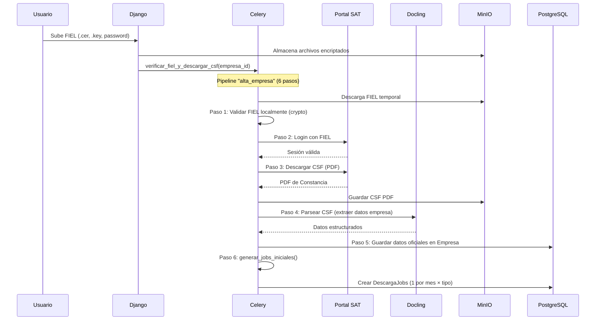
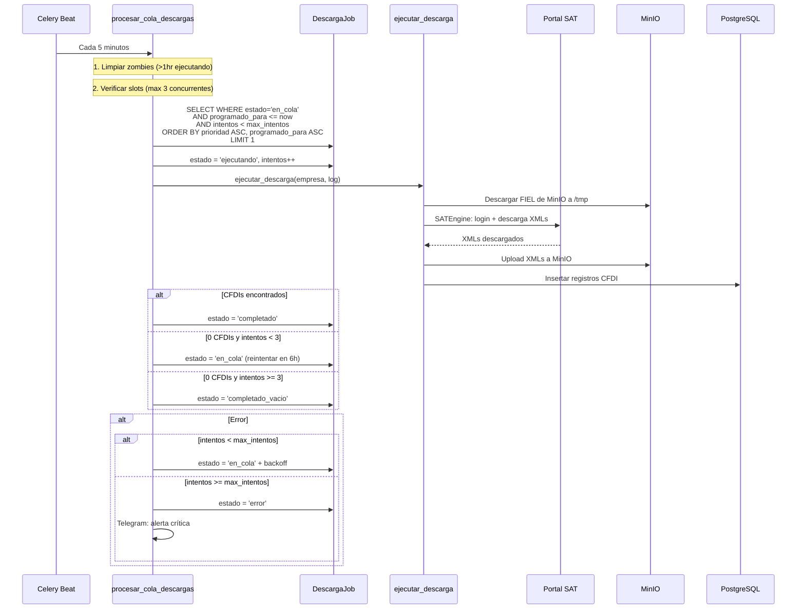
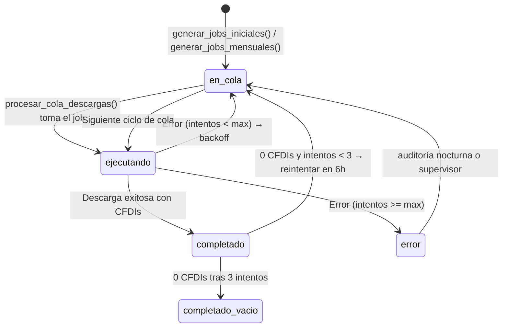

# Descargador de CFDIs — Documentación Técnica

## 1. Resumen

El descargador de CFDIs es el componente central de Cirrus. Automatiza la descarga de facturas electrónicas (CFDIs) desde el portal del SAT utilizando RPA (Robotic Process Automation) con Playwright. Opera como un sistema de cola de prioridad con reintentos escalonados, monitoreo de salud del SAT, y detección automática de gaps.

### Componentes involucrados

| Componente | Archivo | Función |
|------------|---------|---------|
| Task principal | `core/tasks.py` | `descargar_cfdis()` — task Celery con 10 reintentos |
| Procesador de cola | `core/tasks.py` | `procesar_cola_descargas()` — ejecuta jobs cada 5 min |
| Servicio scrapper | `core/services/scrapper.py` | `ejecutar_descarga()` — puente a SATEngine |
| Motor RPA | `sat_scrapper_core` (paquete) | `SATEngine` — Playwright headless, login SAT, descarga |
| Generador de jobs | `core/services/job_scheduler.py` | Crea y programa DescargaJobs |
| Pipeline manager | `core/services/pipeline_manager.py` | Tracking de progreso multi-paso |
| Auditoría nocturna | `core/tasks.py` | `auditoria_nocturna_periodos()` — detecta gaps |
| Supervisor | `core/services/supervisor.py` | Limpieza zombies, detección de huecos |

---

## 2. Flujo Completo

### 2.1 Alta de empresa (primera vez)

`generar_jobs_iniciales()` (`job_scheduler.py:37-95`) crea jobs desde `sync_desde_year/month` hasta el mes actual:
- Orden: **mes más reciente primero** (el usuario ve datos recientes antes)
- Spacing: 5 minutos entre cada job
- Prioridad basada en plan: owner/enterprise=1, pro=3, basico=5, free=9
- Cada job = 1 empresa + 1 mes + 1 tipo (recibidos o emitidos)
- `unique_together` previene duplicados

### 2.2 Descarga continua (cola de jobs)

### 2.3 Auditoría nocturna

`auditoria_nocturna_periodos()` (`tasks.py:774-801`) ejecuta `auditar_y_reparar_jobs()` (`job_scheduler.py:144-219`) para cada empresa activa:

1. Calcula rango de meses según plan (pro/enterprise: 3 años, basico: 2 años, free: 1 año)
2. Para cada mes en el rango, verifica si existen CFDIs reales en BD
3. Si 0 CFDIs: crea job nuevo o resetea job existente a `en_cola`
4. Si job `completado` pero 0 CFDIs: marca como fallo silencioso y re-encola

### 2.4 Generación mensual

`generar_jobs_mensuales()` (`job_scheduler.py:98-141`) se ejecuta el día 1 de cada mes a las 3:00 AM:
- Crea 2 jobs (recibidos + emitidos) para el mes que acaba de cerrar
- Solo para empresas con `sync_activa=True` y `fiel_verificada=True`
- Programación inteligente según plan (ver sección 6)

---

## 3. Máquina de Estados de DescargaJob

### Estados

| Estado | Significado | Siguiente acción |
|--------|-------------|------------------|
| `en_cola` | Esperando turno | `procesar_cola_descargas` lo toma cuando `programado_para <= now` |
| `ejecutando` | Descarga en proceso | Timeout zombie si >1 hora |
| `completado` | Descarga exitosa con CFDIs | Terminal (a menos que sea 0 CFDIs → re-check) |
| `completado_vacio` | 3 intentos confirmaron 0 CFDIs | Terminal — se asume sin actividad fiscal |
| `error` | Agotó `max_intentos` (default 5) | Auditoría nocturna puede re-encolar |

---

## 4. Política de Reintentos

### Reintentos del Job (`procesar_cola_descargas`)

| Intento | Delay antes del siguiente | Archivo |
|---------|---------------------------|---------|
| 1 → 2 | 5 minutos | `tasks.py:752` |
| 2 → 3 | 15 minutos | |
| 3 → 4 | 30 minutos | |
| 4 → 5 | 1 hora | |
| 5+ | 2 horas | |

**Max intentos por defecto:** 5 (`DescargaJob.max_intentos`)

### Reintentos de la Task Celery (`descargar_cfdis`)

| Tipo de error | Delay | Referencia |
|---------------|-------|------------|
| Login fallido (SAT saturado) | 30 minutos | `tasks.py:151-161` |
| Timeout / conexión | 15 minutos | |
| Otros errores | Escalonado: 5m → 10m → 20m → 30m → 1hr | |

**Max reintentos:** 10 (`max_retries=10`)
**Protección contra crash:** `acks_late=True`, `reject_on_worker_lost=True`
**Timeout:** soft=30min, hard=35min

### Reintentos del Pipeline (`pipeline_manager.py`)

El backoff se ajusta según la salud del SAT:

| SAT Health | Delays por intento |
|------------|-------------------|
| < 30% (down) | 30m, 1h, 2h, 4h, 8h |
| 30-70% (degraded) | 15m, 30m, 1h, 2h, 4h |
| > 70% (ok) | 5m, 15m, 30m, 1h, 2h |

---

## 5. Telemetría

Cada descarga mide 16 fases via `DescargaTelemetria` (`models.py:522-575`):

| Fase | Atribuible a | Qué mide |
|------|-------------|----------|
| `fiel_download` | MinIO | Descarga de .cer/.key de MinIO |
| `fiel_decrypt` | Cirrus | Desencriptar password FIEL |
| `browser_launch` | Cirrus | Lanzar Chromium headless |
| `sat_navigate` | Red | Navegar al portal SAT |
| `sat_login` | SAT | Login con e.firma |
| `sat_select_dates` | SAT | Seleccionar fechas en el formulario |
| `sat_search` | SAT | Búsqueda de CFDIs |
| `sat_download_wait` | SAT | Espera de generación del archivo |
| `sat_download_file` | SAT | Descarga del ZIP/XML |
| `engine_run` | SAT | Motor RPA completo (agregado) |
| `xml_parse` | Cirrus | Parseo de XMLs |
| `minio_upload` | MinIO | Upload de XMLs a MinIO |
| `db_insert` | Cirrus | Inserción en PostgreSQL |
| `xml_process` | Cirrus | Procesamiento completo de XMLs |
| `browser_close` | Cirrus | Cerrar navegador |
| `cleanup` | Cirrus | Limpieza de archivos temporales |

Implementación via `StepTimer` (context manager) en `core/services/telemetry.py`.

---

## 6. Ventana Horaria

El sistema programa descargas en horarios de baja carga del SAT:

- **Ventana principal:** 4:00 - 10:00 UTC (10:00 PM - 4:00 AM hora México/CST)
- **Ventana secundaria:** ≥ 22:00 UTC (4:00 PM México en adelante)
- **Excepción:** Descargas iniciales (primera vez) ignoran la ventana horaria

Referencia: `_es_hora_optima()` y `_calcular_programacion()` en `job_scheduler.py:223-248`

### Distribución por plan

| Plan | Días de descarga | Distribución |
|------|------------------|--------------|
| Free | Días 2-5 del mes | Secuencial |
| Basico | Días 8-12 y 18-22 | Bisemanal |
| Pro | Día específico por RFC (hash) | Semanal |
| Enterprise | Cada 3 días | Staggered por RFC |
| Owner | Sin restricción | Inmediato |

---

## 7. Modos de Disparo

### Manual (API o Panel)

- **Panel admin:** `core/views.py:243-266` — POST con year, month_start, month_end, tipos
- **API REST:** `core/api/empresas.py` — `POST /api/v1/empresas/{rfc}/descargar/`
- Dispara `descargar_cfdis.delay()` directamente (no pasa por la cola de jobs)

### Programado (Cola de Jobs)

- `procesar_cola_descargas()` cada 5 minutos toma el siguiente job de la cola
- Orden: `prioridad ASC, programado_para ASC`
- Máximo 3 concurrentes, 1 nuevo por ciclo

### Agente Legacy

- `agente_sincronizacion()` (`tasks.py:804-948`) cada 15 minutos
- Respeta ventana horaria, capacidad de workers, reglas de plan
- Rota RFCs por `ultimo_scrape` (menos reciente primero)
- Coexiste con el sistema de cola de jobs

---

## 8. Almacenamiento

### XMLs de CFDIs

| Dato | Destino | Campo |
|------|---------|-------|
| Archivo XML crudo | MinIO | `CFDI.xml_minio_key` |
| Metadata del CFDI | PostgreSQL | Tabla `CFDI` (30+ campos) |
| Tamaño del archivo | PostgreSQL | `CFDI.xml_size_bytes` |

### Tracking de descargas

| Tabla | Granularidad | Retención |
|-------|-------------|-----------|
| `DescargaJob` | 1 por empresa+mes+tipo | Permanente |
| `DescargaLog` | 1 por intento de descarga | Permanente |
| `DescargaTelemetria` | 1 por fase por intento | Permanente |
| `PipelineState` | 1 por proceso multi-paso | Permanente |

### Archivos FIEL

| Dato | Destino | Encriptación |
|------|---------|-------------|
| .cer | MinIO | Almacenado como-es |
| .key | MinIO | Almacenado como-es |
| Password | PostgreSQL (BinaryField) | Fernet (AES-128-CBC) |

---

## Documentos Relacionados

- [Modelo de Datos](modelo-datos.md) — Estructura de tablas
- [Jobs y Tasks](jobs-y-tasks.md) — Inventario completo de tasks
- [Fallos y Fallbacks](fallos-y-fallbacks.md) — Manejo de errores
