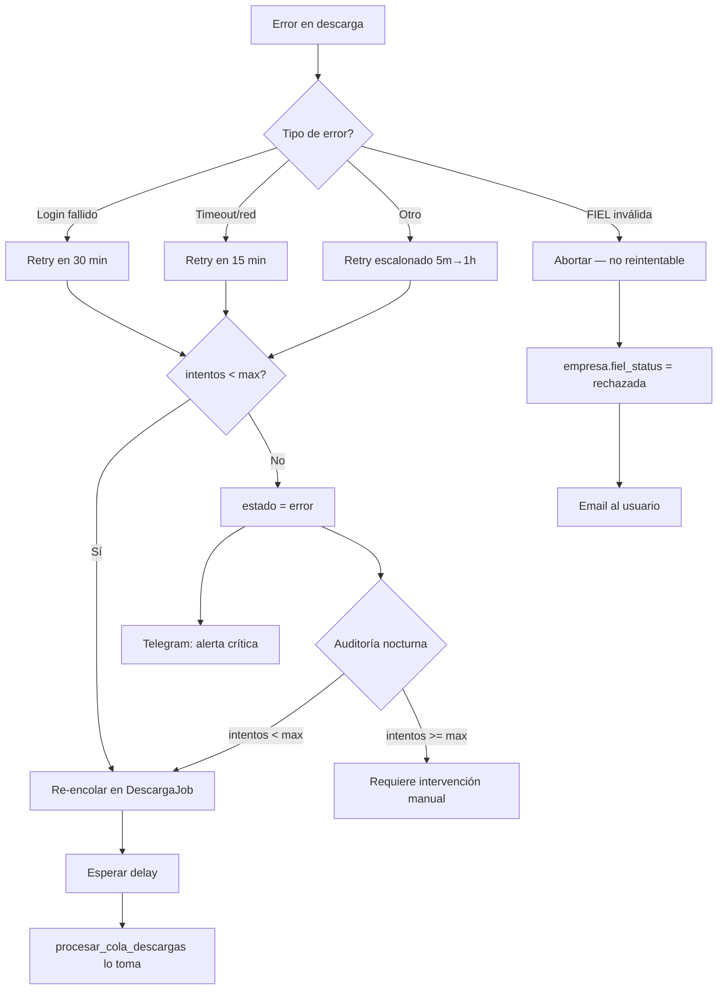

# Fallos y Fallbacks — Documentación Técnica

## 1. Clasificación de Errores

### Errores del SAT (externos, no controlables)
| Error | Causa | Frecuencia |
|-------|-------|------------|
| Login fallido | Credenciales rechazadas, sesión activa en otro dispositivo | Medio |
| Timeout | Portal SAT lento o no responde | Alto (noches/fines de semana) |
| Captcha | SAT detecta automatización | Bajo |
| Mantenimiento | SAT fuera de servicio programado | Ocasional (avisos previos) |
| Fallo silencioso | Página carga pero consulta no devuelve resultados | Raro pero peligroso |

### Errores de red
| Error | Causa | Frecuencia |
|-------|-------|------------|
| DNS failure | Resolución DNS del portal SAT falla | Raro |
| Connection timeout | Red entre servidor y SAT saturada | Medio |
| SSL error | Certificado SAT con problemas | Raro |

### Errores internos (Cirrus)
| Error | Causa | Frecuencia |
|-------|-------|------------|
| Playwright crash | Chromium no puede lanzarse (memoria, dependencias) | Raro |
| MinIO no disponible | Storage offline | Raro |
| PostgreSQL error | Conexión perdida, constraint violation | Raro |
| Worker crash | OOM kill, SIGKILL, reinicio | Ocasional |
| Event loop conflict | `asyncio.run()` con loop existente (ver auditoría C2) | Potencial |

### Errores de datos
| Error | Causa | Frecuencia |
|-------|-------|------------|
| FIEL inválida | Password incorrecto, archivos no coinciden, certificado revocado | Medio |
| FIEL expirada | Certificado vencido | Predecible |
| XML malformado | SAT entrega XML corrupto | Raro |
| CSF parse failure | Docling/pdfplumber no extrae datos del PDF | Medio |

---

## 2. Tabla de Manejo de Errores por Componente

### `descargar_cfdis` (task Celery)

**Archivo:** `core/tasks.py:18-203`

| Error | Acción | Retry | Delay | Alerta |
|-------|--------|-------|-------|--------|
| Login fallido | Reintento | Hasta 10 | 30 min | Telegram si agota |
| Timeout / conexión | Reintento | Hasta 10 | 15 min | Telegram si agota |
| Otros errores | Reintento escalonado | Hasta 10 | 5m → 10m → 20m → 30m → 1h | Telegram si agota |
| Empresa no encontrada | Abortar | 0 | — | Log error |
| Worker crash | Re-encolado automático | — | — | — |

**Protecciones:**
- `acks_late=True` — task solo se confirma al completar (sobrevive restart)
- `reject_on_worker_lost=True` — se re-encola si el worker muere
- `soft_time_limit=1800` (30 min), `time_limit=2100` (35 min)
- Deduplicación: si el mismo RFC+periodo ya completó, se salta

### `procesar_cola_descargas` (procesador de cola)

**Archivo:** `core/tasks.py:598-764`

| Error | Acción | Retry | Delay | Alerta |
|-------|--------|-------|-------|--------|
| Zombie (>1hr ejecutando) | Limpiar: error o re-encolar | Auto | 10 min | Log info |
| Descarga exitosa con 0 CFDIs (intentos < 3) | Re-encolar | Hasta 3 | 6 horas | Log warning |
| Descarga exitosa con 0 CFDIs (intentos >= 3) | Marcar `completado_vacio` | Terminal | — | Log info |
| Excepción en descarga (intentos < max) | Re-encolar con backoff | Hasta 5 | 5m/15m/30m/1h/2h | Log error |
| Excepción en descarga (intentos >= max) | Marcar `error` | Terminal | — | Telegram critical |
| Workers llenos (3 concurrentes) | Esperar al siguiente ciclo | — | 5 min | — |

### `verificar_fiel_y_descargar_csf` (pipeline completo)

**Archivo:** `core/tasks.py:326-494`

| Paso | Error | Acción |
|------|-------|--------|
| Validar FIEL local | Crypto inválida | Pipeline → error, empresa.fiel_status = "rechazada" |
| Login SAT | Fallo login | Pipeline → reintentando (backoff según SAT health) |
| Descargar CSF | SAT no entrega PDF | Continúa sin CSF, activa sync igualmente |
| Parsear CSF (Docling) | Docling caído | Fallback a pdfplumber |
| Parsear CSF (pdfplumber) | Regex no match | Empresa sin datos CSF, sync sigue activa |
| Generar jobs | Error BD | Pipeline → error |

### `sat_health_probe` (monitoreo SAT)

**Archivo:** `core/tasks.py:1244-1410`

| Error | Acción |
|-------|--------|
| Worker HTTP timeout | Registra probe como `timeout` |
| Worker no alcanzable | Registra como `network_error` |
| Cambio de estado (ok→fallo) | Alerta Telegram inmediata |
| Cambio de estado (fallo→ok) | Alerta Telegram de recuperación |

### `csf_parser` (parseo de CSF)

**Archivo:** `core/services/csf_parser.py`

| Error | Acción |
|-------|--------|
| Docling no disponible (10.20.0.5:8000) | Fallback automático a pdfplumber |
| Docling retorna 0 campos | Fallback automático a pdfplumber |
| pdfplumber falla | Retorna dict vacío — empresa sin datos CSF |
| Timeout Docling (>60s) | Fallback a pdfplumber |

---

## 3. Mecanismos de Auto-Recuperación

### Supervisor (cada 15 min)
**Archivo:** `core/services/supervisor.py`

| Mecanismo | Qué detecta | Acción |
|-----------|-------------|--------|
| `limpiar_zombies()` | DescargaLogs en `ejecutando` >1hr | Marca como `error` |
| `detectar_huecos_descarga()` | Meses sin DescargaJob | Crea job + re-encola jobs en `error` |
| `detectar_errores_repetidos()` | 3+ errores consecutivos | Alerta Telegram |
| `verificar_espacio_disco()` | Disco >70% | Warning a Telegram |

### Supervisor de Pipelines (cada 5 min)
**Archivo:** `core/tasks.py:1526-1605`

| Mecanismo | Qué detecta | Acción |
|-----------|-------------|--------|
| SAT Health unlock | SAT >70% disponible | Desbloquea pipelines con `bloqueado_por_sat=True` |
| Re-despacho | Pipelines con retry vencido | Relanza la task correspondiente |
| Limpieza de abandonados | Pipelines activos >2hr sin update | Marca como `error` |
| Re-parseo CSF | Empresas con CSF pero sin datos | Relanza parseo |

### Auditoría Nocturna
**Archivo:** `core/tasks.py:774-801` + `core/services/job_scheduler.py:144-219`

| Mecanismo | Qué detecta | Acción |
|-----------|-------------|--------|
| Gap detection | Meses sin CFDIs en BD | Crea/resetea DescargaJob |
| Fallo silencioso | Job `completado` pero 0 CFDIs | Re-encola como `en_cola` |

### Celery Worker Recovery

| Mecanismo | Protección |
|-----------|-----------|
| `acks_late=True` | Task se re-encola si worker muere antes de completar |
| `reject_on_worker_lost=True` | Task se rechaza (re-entra a la cola) si se pierde el worker |
| Zombie cleanup | Supervisor detecta tasks atascadas >1hr |

---

## 4. Alertas Generadas Automáticamente

### Telegram (admins)

| Evento | Nivel | Cuándo |
|--------|-------|--------|
| Descarga completada | info | Cada descarga exitosa |
| Descarga falló (reintentos agotados) | critical | Tras 10 reintentos fallidos |
| FIEL verificada | success | Tras verificación exitosa |
| FIEL rechazada | error | Tras verificación fallida |
| FIEL por vencer | warning | 90, 60, 30, 15, 7, 3, 1 días antes |
| FIEL expirada | critical | Al expirar (desactiva sync) |
| Playwright no funciona | critical | health_check_playwright falla |
| SAT estado cambió (ok→fallo) | error | Probe detecta cambio |
| SAT estado cambió (fallo→ok) | success | Probe detecta recuperación |
| Resumen horario SAT Health | info | Cada hora |
| Supervisor: zombies limpiados | info | Cuando encuentra zombies |
| Supervisor: errores repetidos | critical | 3+ errores consecutivos por RFC |
| Supervisor: disco lleno | warning/critical | >70% / >85% uso |
| Supervisor: SAT lento | warning | 2x más lento que promedio |
| Job agotó reintentos | critical | DescargaJob con max_intentos agotados |

### Email (clientes)

| Evento | Cuándo |
|--------|--------|
| Registro exitoso | Al crear cuenta |
| Confirmación email | Pendiente de click en link (48hr) |
| FIEL verificada | Al completar pipeline alta_empresa |
| FIEL rechazada | Al fallar verificación |
| Reporte de descarga | Al completar descarga (resumen ejecutivo) |
| Descarga falló definitivamente | Tras agotar todos los reintentos |
| FIEL por vencer | 90, 60, 30, 15, 7, 3, 1 días antes |
| CSD por vencer | Mismos intervalos |

---

## 5. Qué NO Se Recupera Automáticamente

Estos escenarios requieren intervención manual:

| Escenario | Por qué no se auto-recupera | Qué hacer |
|-----------|---------------------------|-----------|
| FIEL rechazada criptográficamente | Password incorrecto o archivos no corresponden | El usuario debe subir FIEL correcta |
| FIEL expirada | Certificado vencido | El usuario debe renovar en sat.gob.mx |
| DescargaJob con `estado=error` y `intentos >= max_intentos` | Agotó reintentos | La auditoría nocturna puede re-encolar si `intentos < max_intentos`, pero si está al máximo, necesita reset manual en admin |
| MinIO caído | No hay fallback de storage | Restaurar MinIO — los XMLs y FIELs están ahí |
| Redis caído | Celery no puede despachar tasks, cache se pierde | Restaurar Redis — las tasks se re-encolan al volver |
| PostgreSQL caído | Todo el sistema depende de la BD | Restaurar PostgreSQL |
| Pipeline abandonado (>2hr) | supervisor_pipelines lo marca como error | Puede relanzarse manualmente desde admin |
| `completado_vacio` falso positivo | SAT falló silenciosamente 3 veces | Reset manual del job + forzar re-descarga |

---

## 6. Diagrama de Flujo de Errores

---

## Documentos Relacionados

- [Descargador CFDI](descargador-cfdi.md) — Flujo completo
- [Jobs y Tasks](jobs-y-tasks.md) — Tasks involucradas
- [Modelo de Datos](modelo-datos.md) — Tablas de estado
- [Alertas y Notificaciones](../usuario/alertas-y-notificaciones.md) — Guía de usuario
