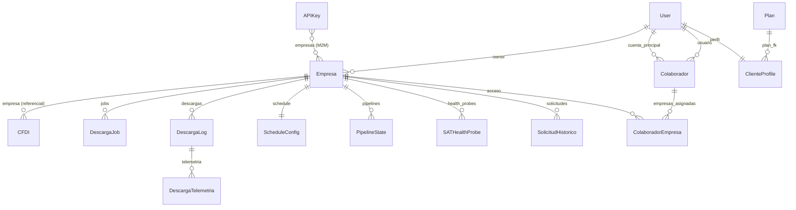

# Modelo de Datos — Documentación Técnica

## 1. Diagrama Entidad-Relación

---

## 2. Tablas del Sistema

### 2.1 Empresa — Tenant principal

**Archivo:** `core/models.py:14-127`
**Propósito:** Cada empresa es un tenant identificado por RFC. Contiene la FIEL encriptada, datos oficiales de la CSF, y configuración de sincronización.

| Campo | Tipo | Propósito |
|-------|------|-----------|
| `id` | UUID (PK) | Identificador único |
| `rfc` | CharField(13), indexed | RFC fiscal — clave de acceso a CFDIs |
| `nombre` | CharField(200) | Nombre legible |
| `owner` | FK → User | Dueño de la empresa en Cirrus |
| **FIEL** | | |
| `fiel_cer_key` | CharField(500) | Key del .cer en MinIO |
| `fiel_key_key` | CharField(500) | Key del .key en MinIO |
| `fiel_password_encrypted` | BinaryField | Password encriptado con Fernet |
| `fiel_verificada` | Boolean | Login probado contra SAT |
| `fiel_status` | CharField(20) | sin_fiel / verificando / verificada / rechazada / expirada |
| `fiel_expira` | DateTime | Fecha de expiración del certificado |
| **CSD** (futuro) | | |
| `csd_cer_key`, `csd_key_key` | CharField(500) | Archivos CSD en MinIO |
| `csd_password_encrypted` | TextField | Password CSD encriptado |
| `csd_activo` | Boolean | CSD habilitado |
| **Sincronización** | | |
| `sync_desde_year/month` | Integer | Desde cuándo sincronizar |
| `sync_activa` | Boolean | Sincronización automática habilitada |
| `sync_completada` | Boolean | Todos los meses ya descargados |
| `descarga_activa` | Boolean | Descargas permitidas |
| `ultimo_scrape` | DateTime | Última descarga exitosa |
| **Datos CSF** | | |
| `razon_social` | CharField(500) | Razón social oficial |
| `regimen_fiscal` | CharField(200) | Régimen fiscal |
| `codigo_postal` | CharField(5) | CP fiscal |
| `direccion_*` | CharField | Calle, num_ext, num_int, colonia, localidad, municipio, estado |
| `actividades_economicas` | JSONField | Lista de actividades económicas |
| `csf_minio_key` | CharField(500) | PDF de la CSF en MinIO |

**Índices:** `rfc` (db_index)

---

### 2.2 CFDI — Factura electrónica individual

**Archivo:** `core/models.py:130-227`
**Propósito:** Metadata de cada CFDI descargado. El XML crudo se almacena en MinIO.

| Campo | Tipo | Propósito |
|-------|------|-----------|
| `uuid` | UUID (PK) | UUID del Timbre Fiscal Digital |
| `rfc_empresa` | CharField(13), indexed | RFC canónico — define quién tiene acceso |
| `empresa` | FK → Empresa (nullable) | Empresa que originó la descarga (referencial) |
| `tipo_relacion` | CharField(10), indexed | recibido / emitido |
| **Comprobante** | | |
| `version` | CharField(5) | "3.3" o "4.0" |
| `fecha` | DateTime, indexed | Fecha de emisión |
| `total` | Decimal(18,2), indexed | Total del comprobante |
| `subtotal` | Decimal(18,2) | Subtotal |
| `moneda` | CharField(10) | MXN, USD, etc. |
| `tipo_comprobante` | CharField(5), indexed | I=Ingreso, E=Egreso, T=Traslado, N=Nómina, P=Pago |
| **Emisor** | | |
| `rfc_emisor` | CharField(13), indexed | RFC de quien emite |
| `nombre_emisor` | CharField(300) | Razón social del emisor |
| **Receptor** | | |
| `rfc_receptor` | CharField(13), indexed | RFC de quien recibe |
| `nombre_receptor` | CharField(300) | Razón social del receptor |
| **Impuestos** | | |
| `iva` | Decimal(18,2) | IVA trasladado |
| `isr_retenido` | Decimal(18,2) | ISR retenido |
| `iva_retenido` | Decimal(18,2) | IVA retenido |
| **Storage** | | |
| `xml_minio_key` | CharField(500) | Key del XML en MinIO |
| `xml_size_bytes` | Integer | Tamaño del archivo |
| **Estado** | | |
| `estado_sat` | CharField(20), indexed | vigente / cancelado |
| `fuente` | CharField(20) | rpa / manual / upload |

**Índices compuestos (5):**
1. `(empresa, fecha)` — consultas por empresa ordenadas por fecha
2. `(empresa, tipo_relacion, fecha)` — filtro por tipo
3. `(rfc_emisor, fecha)` — buscar facturas de un emisor
4. `(rfc_receptor, fecha)` — buscar facturas para un receptor
5. `(rfc_empresa, fecha)` — acceso por RFC verificado (principal)

**Nota importante:** El acceso a CFDIs se determina por `rfc_empresa` (quién tiene FIEL verificada para ese RFC), NO por `empresa` (que es solo referencial).

---

### 2.3 DescargaJob — Cola de descarga

**Archivo:** `core/models.py:262-316`
**Propósito:** Cola ordenada por prioridad. Un job = 1 empresa + 1 mes + 1 tipo.

| Campo | Tipo | Propósito |
|-------|------|-----------|
| `empresa` | FK → Empresa | Empresa a descargar |
| `year` | Integer | Año del periodo |
| `month` | Integer | Mes del periodo |
| `tipo` | CharField(15) | recibidos / emitidos |
| `estado` | CharField(20) | en_cola / ejecutando / completado / completado_vacio / error |
| `prioridad` | Integer | 1=owner, 3=pro, 5=basico, 9=free |
| `programado_para` | DateTime | No ejecutar antes de esta fecha |
| `intentos` | Integer | Intentos realizados |
| `max_intentos` | Integer (default 5) | Máximo de reintentos |
| `cfdis_descargados/nuevos` | Integer | Resultados |
| `duracion_segundos` | Integer | Duración total |
| `ultimo_error` | TextField | Último error registrado |

**Constraint:** `unique_together = ["empresa", "year", "month", "tipo"]`
**Ordering:** `["prioridad", "programado_para"]` — cola de prioridad natural

---

### 2.4 DescargaLog — Log de ejecución

**Archivo:** `core/models.py:319-378`
**Propósito:** Registro de cada intento de descarga (puede haber varios por job).

| Campo | Tipo | Propósito |
|-------|------|-----------|
| `id` | UUID (PK) | Identificador único |
| `empresa` | FK → Empresa | Empresa descargada |
| `estado` | CharField(20) | pendiente / ejecutando / completado / error / cancelado |
| `year`, `month_start`, `month_end` | Integer | Rango descargado |
| `tipos` | JSONField | ["recibidos", "emitidos"] |
| `cfdis_descargados/nuevos/duplicados` | Integer | Contadores |
| `errores` | JSONField | Lista de errores |
| `progreso` | TextField | Mensaje de progreso en tiempo real |
| `celery_task_id` | CharField(100) | ID de la task Celery |
| `triggered_by` | CharField(20) | manual / schedule / api |
| `duracion_segundos` | Integer | Duración total |

---

### 2.5 DescargaTelemetria — Métricas por fase

**Archivo:** `core/models.py:522-575`
**Propósito:** Mide duración de cada fase de una descarga para identificar cuellos de botella.

| Campo | Tipo | Propósito |
|-------|------|-----------|
| `descarga_log` | FK → DescargaLog | Log padre |
| `fase` | CharField(30) | 16 fases posibles (ver [descargador-cfdi.md](descargador-cfdi.md#5-telemetría)) |
| `inicio/fin` | DateTime | Timestamps |
| `duracion_ms` | Integer | Duración en milisegundos |
| `atribuible_a` | CharField(20) | cirrus / sat / red / minio |
| `exitoso` | Boolean | Si la fase completó sin error |
| `metadata` | JSONField | Datos adicionales (ej. total_files) |

---

### 2.6 PipelineState — Progreso multi-paso

**Archivo:** `core/models.py:886-975`
**Propósito:** Tracking de procesos complejos de varios pasos con integración SAT Health.

| Campo | Tipo | Propósito |
|-------|------|-----------|
| `empresa` | FK → Empresa | Empresa del pipeline |
| `pipeline_type` | CharField(30) | alta_empresa / descarga_cfdis / csf_mensual / verificacion_fiel |
| `estado` | CharField(20) | pendiente / en_proceso / esperando_sat / completado / error / reintentando |
| `paso_actual/total_pasos` | Integer | Progreso |
| `pasos_detalle` | JSONField | Array con estado de cada paso |
| `intento_actual/max_intentos` | Integer | Reintentos del paso actual |
| `bloqueado_por_sat` | Boolean | Pipeline pausado por SAT no disponible |
| `mensaje_cliente` | CharField(500) | Mensaje visible para el usuario |

**Propiedad calculada:** `progreso_pct` — porcentaje de completitud basado en pasos completados.

---

### 2.7 SATHealthProbe — Probe individual

**Archivo:** `core/models.py:689-762`
**Propósito:** Registro de cada intento de login al SAT para medir disponibilidad.

| Campo | Tipo | Propósito |
|-------|------|-----------|
| `node_id` | CharField(20) | vps2 / vpsx / spark |
| `rfc_used` | CharField(13) | RFC usado para la prueba |
| `result` | CharField(20) | success / timeout / login_failed / captcha / maintenance / network_error / browser_error |
| `last_phase_reached` | CharField(20) | Última fase completada |
| `time_dns_ms` ... `time_session_active_ms` | Integer | Timing por fase |
| `time_total_ms` | Integer | Tiempo total |
| `screenshot_path` | CharField(500) | Screenshot en MinIO (si falló) |

**Índices compuestos (3):**
1. `(timestamp, result)`
2. `(node_id, timestamp)`
3. `(rfc_used, timestamp)`

---

### 2.8 SATHealthSummary — Resumen horario

**Archivo:** `core/models.py:764-787`

| Campo | Tipo | Propósito |
|-------|------|-----------|
| `hour` | DateTime (unique) | Hora truncada |
| `total/successful/failed_probes` | Integer | Contadores |
| `availability_pct` | Float (0-100) | Porcentaje de disponibilidad |
| `avg/min/max_total_time_ms` | Integer | Estadísticas de tiempo |
| `most_common_error` | CharField(20) | Error más frecuente |
| `results_by_node` | JSONField | Desglose por nodo |

---

### 2.9 Plan — Planes de suscripción

**Archivo:** `core/models.py:577-633`

| Campo | Tipo | Propósito |
|-------|------|-----------|
| `slug` | SlugField (unique) | free / basico / pro / enterprise / owner |
| `precio_mensual` | Decimal | Precio en MXN |
| `max_empresas` | Integer | Límite de RFCs |
| `max_colaboradores` | Integer | Límite de colaboradores |
| `max_descargas_mes` | Integer | Límite de descargas manuales |
| `max_cfdis_visibles` | Integer | CFDIs visibles en panel |
| `max_conversiones_pdf/excel` | Integer | Conversiones por mes |
| `api_rest` | Boolean | Acceso a API |
| `api_nivel` | CharField | none / read / full |
| `stripe_product_id/price_id` | CharField | Integración Stripe |
| `precio_descarga_extra` ... | Decimal | Precios de excedentes |

---

### 2.10 Tablas auxiliares

| Tabla | Archivo | Propósito |
|-------|---------|-----------|
| **SystemLog** | `models.py:481-519` | Logging centralizado (level, category, message, detail) |
| **ScheduleConfig** | `models.py:381-429` | Configuración de descarga por empresa (frecuencia, horario, jitter) |
| **Colaborador** | `models.py:790-849` | Relación cuenta_principal → usuario con permisos globales |
| **ColaboradorEmpresa** | `models.py:852-883` | Override de permisos por empresa específica |
| **APIKey** | `models.py:230-259` | Keys para APIs externas (M2M con Empresa) |
| **EFOS** | `models.py:658-686` | Lista 69-B del SAT (contribuyentes sospechosos) |
| **ConversionLead** | `models.py:432-453` | Leads del conversor público |
| **ConversionLog** | `models.py:456-478` | Registro de cada conversión PDF/Excel |
| **SolicitudHistorico** | `models.py:636-655` | Solicitudes de compra de años históricos |

---

## 3. Seguridad de Datos

### FIEL (e.firma)
- **Password:** Encriptado con Fernet (AES-128-CBC) usando `FIEL_ENCRYPTION_KEY` de settings
- **Archivos .cer/.key:** Almacenados en MinIO, nunca en disco local (excepto temporalmente durante descarga)
- **Acceso:** Solo el owner de la empresa o colaboradores con `puede_subir_fiel=True`

### Sesiones
- Cookie segura: `SESSION_COOKIE_SECURE=True`, `HttpOnly=True`, `SameSite=Lax`
- Expiración: 8 horas o cierre de browser
- CSRF: `CSRF_COOKIE_SECURE=True`

### API Keys
- Key única de 64 caracteres
- Permisos granulares: `puede_leer`, `puede_trigger_descarga`
- Scoped a empresas específicas (M2M)

---

## Documentos Relacionados

- [Descargador CFDI](descargador-cfdi.md) — Flujo de descarga
- [Jobs y Tasks](jobs-y-tasks.md) — Tasks que operan sobre estos modelos
- [Fallos y Fallbacks](fallos-y-fallbacks.md) — Cómo se manejan errores
